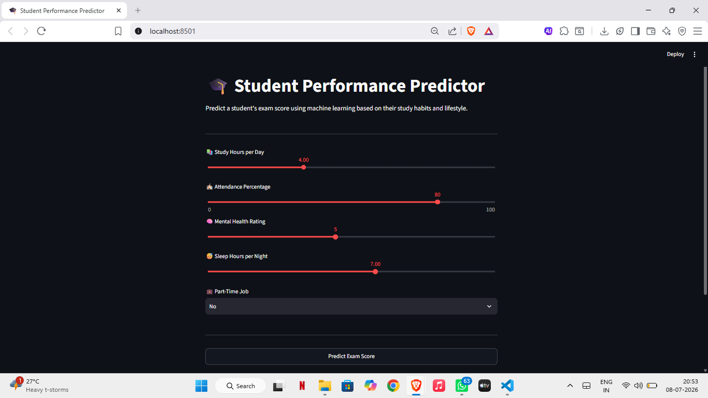
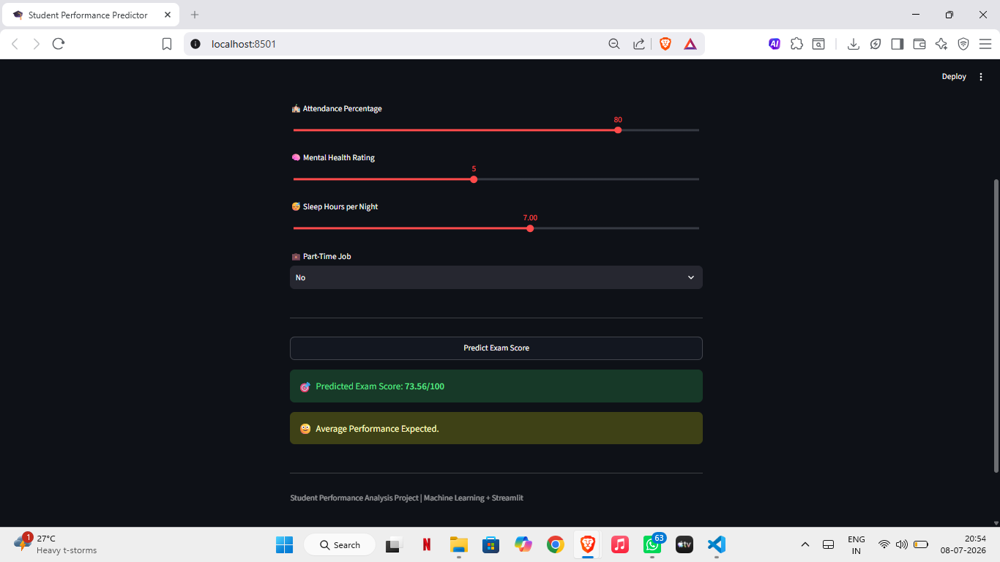

# Student Performance Analysis using Machine Learning

## Project Overview

This project predicts a student's exam score based on academic and lifestyle factors using Machine Learning.

The model is trained in Google Colab and deployed using Streamlit to provide an interactive web application for real-time predictions.

---

## Features

- Predicts student exam scores
- Interactive Streamlit web application
- Real-time prediction
- Machine Learning based regression model
- Simple and user-friendly interface

---

## Project Structure

```
Student-Performance-Analysis/
│
├── best_model.pkl
├── student_performance_analysis.ipynb
├── student_performance_analysis_app.py
├── data/
│   └── student_habits_performance-selected-columns.csv
├── output_images/
│   ├── home.png
│   └── prediction.png
├── requirements.txt
└── README.md
```

---

## Technologies Used

- Python
- NumPy
- Pandas
- Scikit-learn
- Joblib
- Streamlit
- Google Colab
- VS Code

---

## Machine Learning Model

**Algorithm Used**

- Linear Regression

---

## Dataset

The dataset contains information related to students' academic habits and lifestyle factors, including:

- Study Hours
- Attendance Percentage
- Mental Health Rating
- Sleep Hours
- Part-Time Job Status

These features are used to predict the student's final exam score.

---

## Installation

Clone the repository

```bash
git clone https://github.com/Lakshay-Kapoor-OG/Student-Performance-Analysis.git
```

Navigate to the project directory

```bash
cd Student-Performance-Analysis
```

Install the required libraries

```bash
pip install -r requirements.txt
```

---

## Running the Application

```bash
python -m streamlit run student_performance_analysis_app.py
```

---

## Output

### Home Page



### Prediction Result



---

## Author

Lakshay Kapoor

B.Tech Computer Science Engineering (Data Science)

Manav Rachna International Institute of Research and Studies

---

## GitHub Repository

https://github.com/Lakshay-Kapoor-OG/Student-Performance-Analysis
